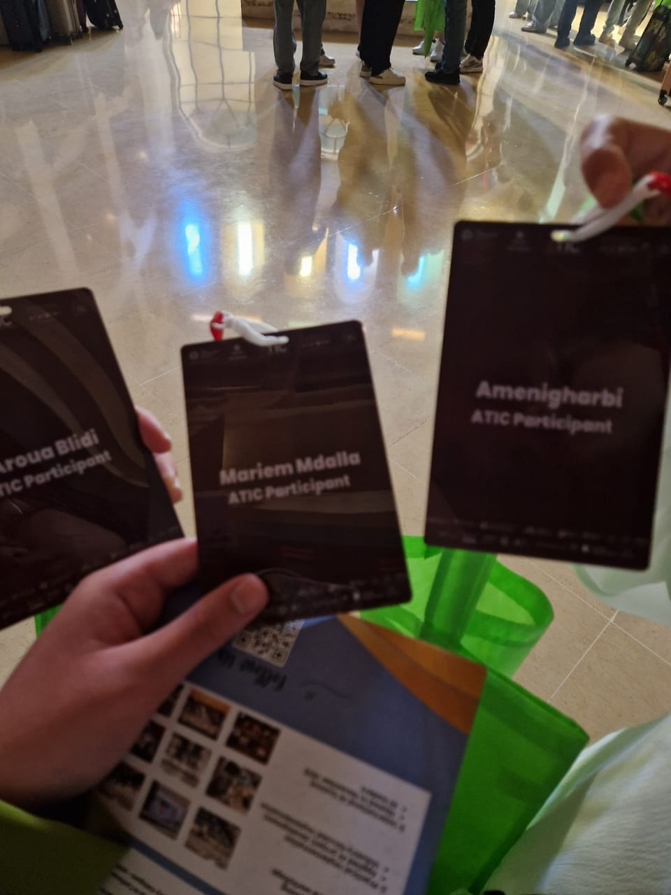
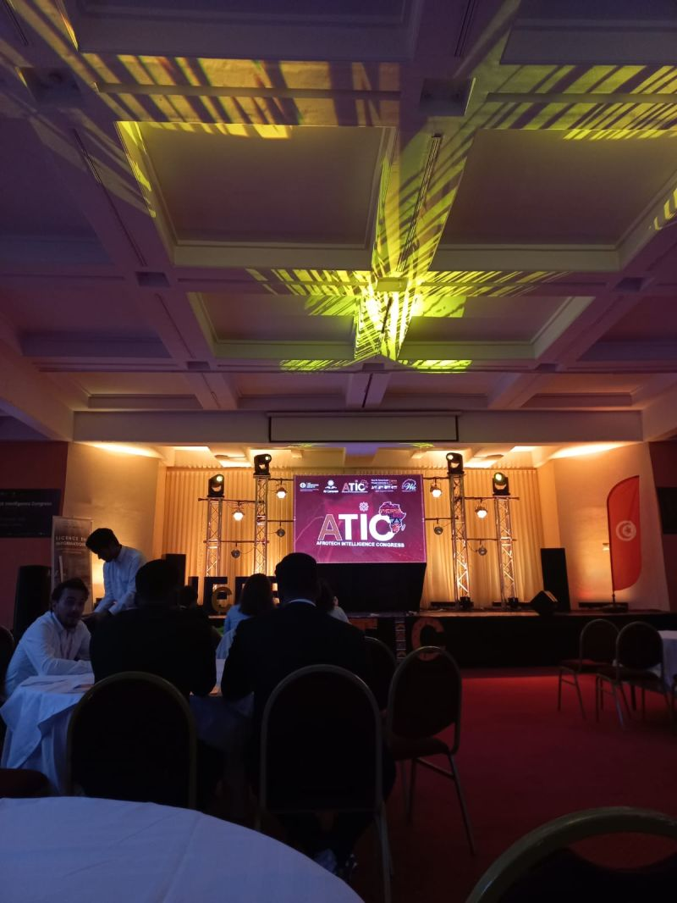
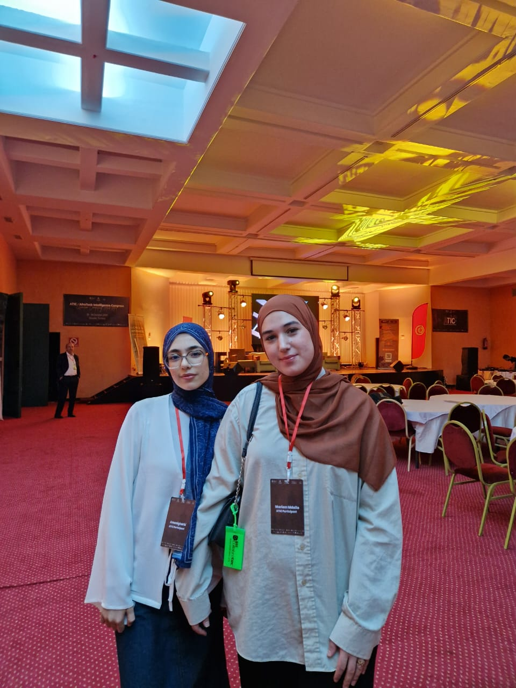

Attending the **ATIC Congress 2025** was an incredibly inspiring milestone in my journey as a Software Engineering student. It was my first time stepping out of the classroom to immerse myself in a large-scale national technology congress, and it exceeded all my expectations.

Throughout the event, I had the opportunity to choose and attend workshops that perfectly aligned with my growing interests in systems architecture and security. Some of the most impactful sessions included:

* **Post-Quantum Cryptography & Quantum Computing Algorithms:** A fascinating look into how the next generation of computing will force us to rethink encryption and data protection entirely.
* **IoT & Sustainability:** Exploring how smart, interconnected devices can be leveraged to build a more sustainable future.
* **Women in Quantum Computing:** I proudly participated in a lively debate on whether there should be targeted programs to encourage women in the Quantum Computing space (I strongly supported the "yes" side!).

The defining moment for me was the final workshop on **The Future of Cybersecurity**. It was a wake-up call that crystallized exactly what I want to do next. Seeing the scale of the challenges ahead reignited my motivation to keep pushing toward my dream career in application and infrastructure security. 

But honestly, the best part wasn't just the technical topics—it was the people. 

Networking with passionate, kind, and inspiring students and professionals from so many different backgrounds made the entire experience unforgettable. Everyone was remarkably open and willing to share their experiences, which reminded me exactly why I love the tech community.

A huge thank you to [Mohamed Zouari](https://www.linkedin.com/in/mohamedzouari202/), Chair of the ATIC Congress, and to everyone I met during those few days. You made this event a turning point for me, and I can't wait to see where these new connections and ideas lead.
