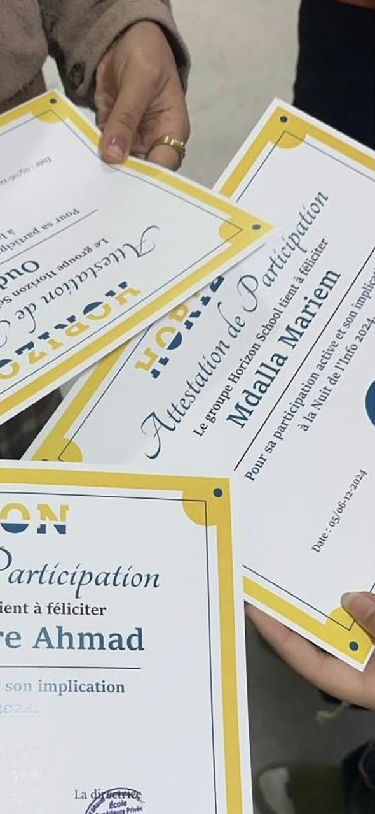

Participating in **Nuit de l'Info** is a rite of passage. It is a national overnight coding competition in Tunisia where teams have from sunset to sunrise to build a complete web project based on a surprise theme.

I have participated in both the 2024 and 2025 editions, and each time, it has been an incredible mix of chaos, collaboration, and intense coding.

### Surviving the Night

When the sun goes down, the energy in the room is electric. You spend the first few hours debating architecture, assigning roles, and setting up the repository. By 3:00 AM, the exhaustion hits, and that is when the real test begins. You have to learn how to communicate clearly when everyone is tired, make fast decisions about what features to cut, and figure out how to debug code with blurry eyes.

### Why I Keep Going Back

Competing twice has fundamentally changed how I view software development. It pushed my ability to work under pressure and taught me that a good, deployed product is always better than a perfect, unfinished idea. 

The chaos of the last hour before sunrise—when everyone is frantically trying to get their final commits merged and the demo working—is an adrenaline rush you can't find in a normal classroom. If you ever get the chance to participate in an overnight hackathon, do it. You will lose a night of sleep, but you will gain an unforgettable experience.
